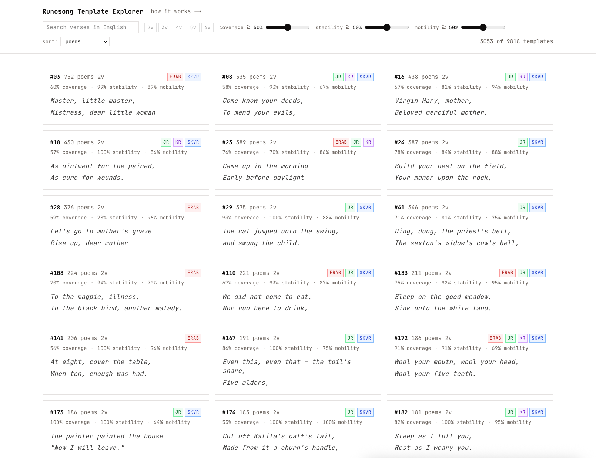
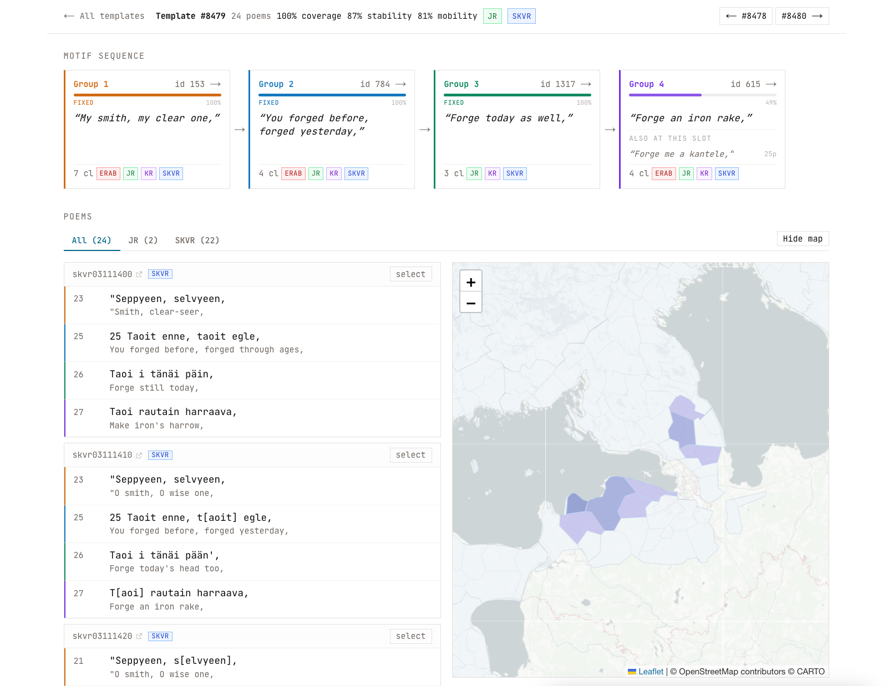

# 2026 DHH Report – Finnic Runosong Template Explorer

**Chiunhau You** · 19.06.2026

## 1. Goal

The goal of this project is to identify recurring multi-verse formulaic patterns ("templates") across the ~294,000-poem corpus of Finnic runosong. By detecting ordered sequences of semantically grouped verse that recur across many poems, we aim to surface the multi-verse compositional unit of the oral poetry at a scale that manual analysis cannot reach.

## 2. Data

The corpus contains:

- **~294k poems** across four collections (SKVR, JR, ERAB, KR)
- **~3.5M poetry lines**
- **Pre-computed verse clusterings** at multiple similarity thresholds (we use variant 4, "loose" at threshold 0.75)
- **English translations** of verses generated by LLM (DeepSeek), used for cross-cluster semantic comparison

## 3. Method

The pipeline has four stages:

### Stage 1: Verse Group Construction

Verse clusters that are semantically similar are merged into broader **verse groups** using TF-IDF cosine similarity on their English translations. Clusters with frequency ≥ 21 are included. Pairwise similarities in the range (0.50, 0.99) are computed in chunks, and connected components of the resulting similarity graph define the groups.

**Result:** 4,825 verse groups covering 13,723 clusters.

### Stage 2: Verse Labelling and N-gram Extraction

Every verse occurrence in the corpus is tagged with its verse group ID, yielding 804,333 labelled positions across 179,547 poems. A sliding window then extracts ordered n-tuples (n = 2–6) of verse groups within each poem, subject to:

- Maximum gap of 5 positions between consecutive slots
- All group IDs in the tuple must be distinct

### Stage 3: Template Aggregation

N-gram sequences appearing in ≥ 15 distinct poems are promoted to **templates**. A containment graph links shorter templates to longer ones that include them as sub-sequences.

**Result:** 9,816 templates (5,349 bigrams, 2,617 trigrams, 1,145 4-grams, 486 5-grams, 219 6-grams). The most frequent template appears in 1,022 poems.

### Stage 4: Quality Scoring

Three scores characterize each template:

**Coverage** measures the fraction of a template's poems that are not already explained by a longer parent template. Since shorter templates are often sub-sequences of longer ones, coverage distinguishes independently meaningful patterns (coverage near 1) from redundant fragments that only appear as part of a larger structure (coverage near 0).

**Slot stability** measures how fixed each position within a template is. For a given template and slot position, we find all "sibling" templates that share the same verse groups at every other position but differ at this one. Stability is the template's poem count divided by the total across all siblings. A stability near 1 means the slot is formulaic — the same verse group almost always fills that position. A stability near 0 means the slot is highly interchangeable, with many alternative verse groups appearing in that position.

**Mobility** measures how freely a template moves within the poems it appears in. For each occurrence, the starting verse position is normalised by poem length and binned into three zones (early, middle, late). Mobility is the Shannon entropy of this distribution, normalised to [0, 1]. A mobility near 0 means the template is anchored — it always appears at the same relative position (e.g., always near the opening). A mobility near 1 means it roams freely across different positions in different poems.

## 4. Corpus Coverage

| Level | Covered | Total | % |
|---|---|---|---|
| Verse positions labelled with a group | 804,333 | 4,367,242 | 18.4% |
| Poems with at least one labelled verse | 179,547 | 294,367 | 61.0% |
| Poems containing at least one template | 88,382 | 294,367 | 30.0% |

The pipeline labels 18.4% of all verse positions with a verse group. In this setup, only clusters with frequency ≥ 21 qualify, so rare or unique lines are excluded by design. Still, 61% of poems contain at least one labelled verse, and 30% of all poems contain at least one template.

## 5. Interactive Interface

To make the pipeline results accessible for qualitative exploration, we built a web-based **Template Explorer** at [dhh-poetry.vercel.app](https://dhh-poetry.vercel.app/). It has two main features:

1. **Browsing and filtering.** The main view displays templates as cards, each showing a representative English verse excerpt, collection tags (e.g. SKVR, JR, ERAB, KR), and the three quality scores as percentages. Users can filter templates by minimum coverage, stability, and mobility thresholds, and sort by poem count or any of the three scores. Of the 9,816 total templates, 3,053 pass the default ≥50% quality filter, providing a curated starting point.

2. **Template detail view.** Clicking a template opens a detail page showing its full structure: each slot with its verse group, the percentage of poems where that slot is fixed, and the textual variants that fill it. Below, the poems containing the template are listed with their original text and English translations, grouped by collection. A map visualization shows the geographic distribution of the poems. This allows researchers to inspect specific formulaic patterns and compare across the region.

## 6. Limitations and Future Work

- The pipeline relies on English translations for cross-cluster similarity; gaps or inconsistencies in translation quality may affect group formation.
- Current clustering approach forces a verse into only one cluster, potentially losing its membership in multiple overlapping semantic fields.
- The current thresholds (similarity range, minimum frequency, gap size, minimum poem count) were chosen based on intuition but have not been systematically optimized for this corpus.
- Templates capture surface-level structural recurrence — fixed sequences of similar verse groups. However, the same motif can be expressed in very different forms: with different verse orderings, varying numbers of verses, or entirely different word choices. The current pipeline cannot group such structurally dissimilar expressions into a single motif.
